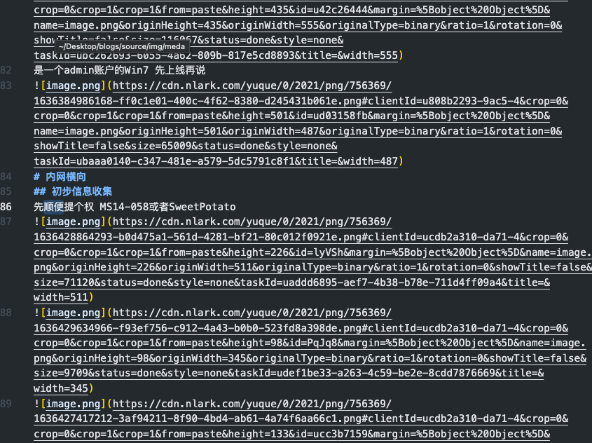
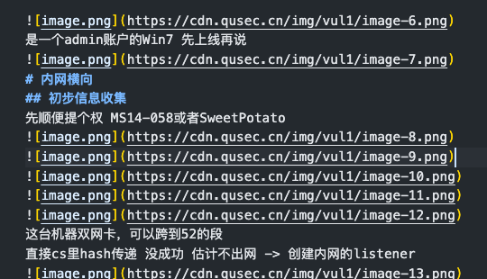
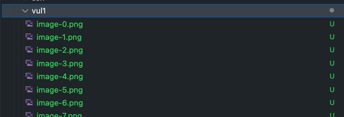

# yuque2md
语雀导出markdown之后，图片链接仍然指向语雀的CDN，如果我们想发布到别的平台或者本地离线查看的话，不太方便。使用本工具可以将图片下载灵活存储到本地后，对应修改markdown文件中的链接指向。

# 用法
基础
```python
python main.py [origin_md_path] [output_md_path] [image_dir] [image_url_prefix] [image_rename_mode]
    origin_md_path: 输入的markdown文件路径
    output_md_path: 输出的markdown文件路径
    image_dir: 图片存储的目录
    image_url_prefix: 图片链接前缀，空字符串或者路径或者CDN地址
    image_rename_mode: 图片重命名模式，raw: 原始uuid模式，asc: 递增重命名模式
```
示例
```
python main.py raw.md out.md images '' raw
python main.py raw.md out.md images 'http://cdn.xx.xx/' asc
```
从语雀官网导出的md:

处理后的md:

下载的图片:
